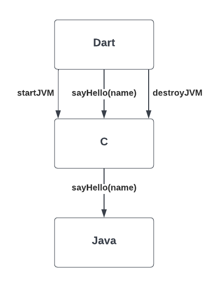
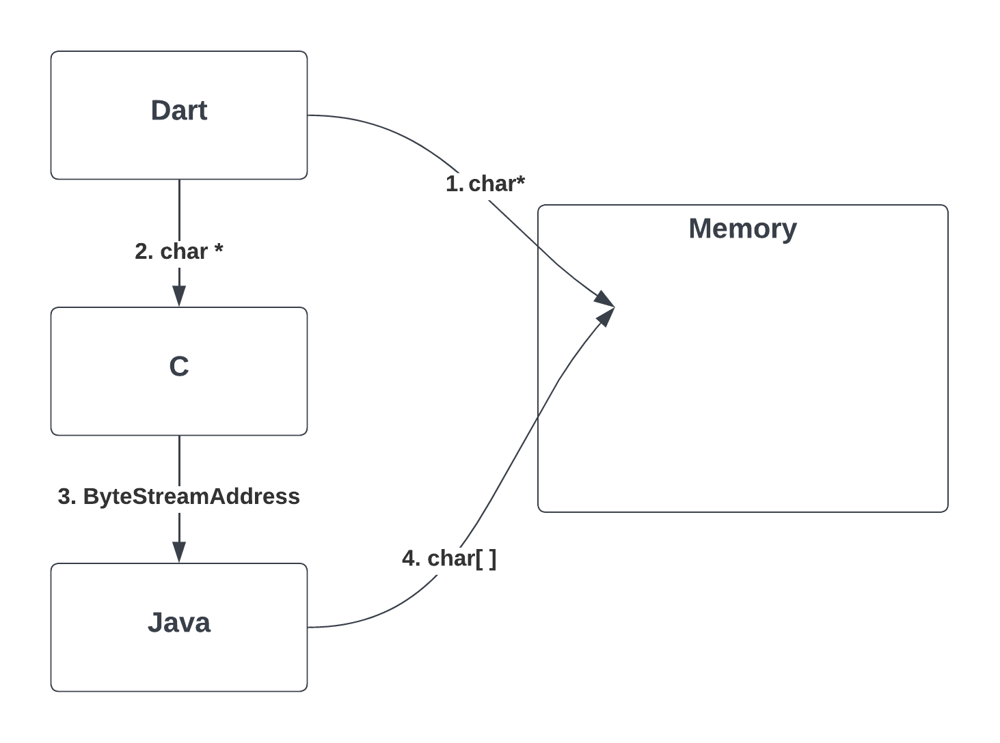
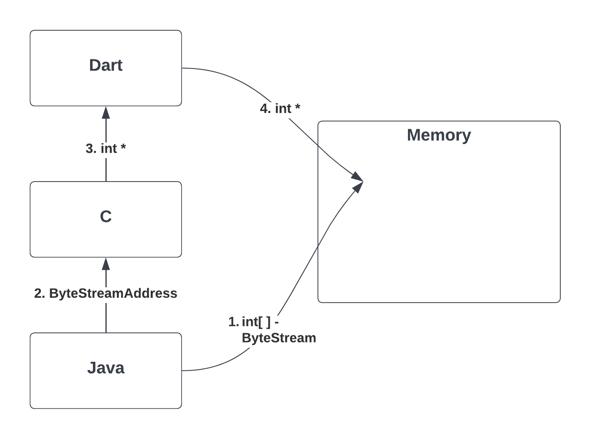
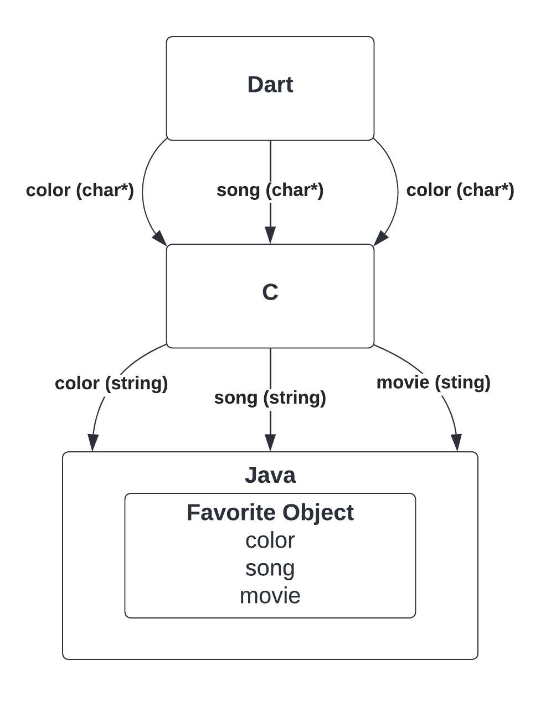

# GSoC'22 Demo

This repo contains proof of concept spaghetti code for Dart interop Java with C as intermediate interface and using JNI and dart:fii. This is made for GSoC '22 by Prayas Kumar Singh, a student at BITS Pilani, Goa Campus, India.

Click [here](https://www.youtube.com/watch?v=cpiZViWvCKM) or on the image below to get a video demo of the projects.

---

## How to run Programs

### Requirements

x86 JDK installed with $JAVA_HOME set in PATH

Dart-lang installed

### compile.sh

Java and C program files can easily compile using `./compile.sh` scripts. This script compiles the java file to java bytecode. Followed by compiling C and attaching runtime environment files (JNI and JLI files). Lastly calls Dart’s main function is to run the program.

This should seamlessly work for Apple Silicone Mac with installed requirements. Other environments like Windows and Linux will require changes like compiling and making references to environment-specific dynamic files (.dll and .so files) in each program.

I could have used software like CMAKE, etc but for simplicity, I decided not to.

---

## Description of examples

### Example 1 : Hello World

This example takes the `name` of the user as input in dart as `Pointer<char>`. Then passes the input to C using dart:ffi, which in turn passes this input to Java in JVM using JNI. Lately, Java code prints a greeting with `name`.

The program also shows the flow of control by printing outputs in the terminal.

---

### Example 2: Manipulate Dart Data

This example manipulates Dart code in Java using ByteStream API in Java.

A pointer called `myPokemon` in Dart is created and passed to a method `evolve()` in Java through C. The method changes the value stored at `myPokemon` pointer.

The thing to note is the flow of data is only a pointer down into Java. No data comes out of Java and the value stored is changed.

---

### Example 3: Read Java Memory

This example allocates an array of 10 `int` or `int[10]` in form of bytestream in Java and the pointer is given up to dart using C. The data stored in this array is accessed using functions in dart.

The thing to note is the flow of data is only a pointer up to Dart. No data comes out of Java and still, data is accessed. It is also possible to alter data, but I haven’t for simplicity of example. The changes made to data on either side will be reflected on both sides as they are at the same memory location.

---

### Example 4: Java Object Manipulation by Dart Code

This example creates an object of class `Favorite` in Java which holds information like your favorite color, song, and movie. The main control of the program is always in Dart. The Dart program asks for your new favorite as and updates the `Favorite` object using an interface created using C functions.

The thing to note is control of the program is always with the dart and the `Favorite` Class in Java has no methods.
